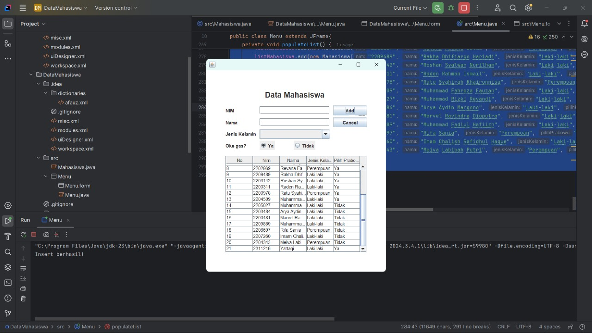

# **TP4DPBO2025C2**  

## **Janji**  
Saya Yattaqi Ahmad Faza dengan NIM 2311216 mengerjakan Tugas Praktikum 4 dalam mata kuliah Desain Pemrograman Berorientasi Objek untuk keberkahanNya maka saya tidak melakukan kecurangan seperti yang telah dispesifikasikan. Aamiin.  

## **Deskripsi Tugas**  
Program ini dibuat menggunakan konsep **Object-Oriented Programming (OOP)** dengan **Java Swing** sebagai GUI-nya. Program ini bertujuan untuk mengelola data **Mahasiswa** dengan fitur CRUD (Create, Read, Update, Delete).  

### **Spesifikasi Kelas dan Hubungan Antar Kelas**  
Program memiliki satu kelas utama **Mahasiswa** yang menyimpan informasi mahasiswa dengan atribut sebagai berikut:  
- **NIM** → Nomor Induk Mahasiswa  
- **Nama** → Nama lengkap mahasiswa  
- **Jenis Kelamin** → Laki-laki / Perempuan  
- **Pilih Prabowo** → Pilihan mahasiswa terhadap Prabowo (Ya / Tidak)  

Kelas ini memiliki **constructor, getter, dan setter** untuk mengelola data mahasiswa.  

## **Fitur Program**  
Program ini memiliki beberapa fitur utama:  

1. **Menampilkan Data Mahasiswa**  
   - Data mahasiswa ditampilkan dalam bentuk tabel dinamis menggunakan `JTable`.  
   - Data dalam tabel dapat diperbarui secara otomatis setelah perubahan.  

2. **Menambahkan Mahasiswa Baru**  
   - User dapat menambahkan data mahasiswa baru melalui `JTextField`, `JComboBox`, dan `JRadioButton`.  
   - Data yang diinput akan langsung masuk ke dalam tabel.  

3. **Mengupdate Data Mahasiswa**  
   - User dapat memilih data dari tabel, kemudian mengeditnya.  
   - Setelah perubahan disimpan, data dalam tabel akan diperbarui.  

4. **Menghapus Data Mahasiswa**  
   - User dapat menghapus data mahasiswa yang dipilih.  
   - Sebelum menghapus, akan ada konfirmasi untuk memastikan tindakan ini.  

5. **Fitur Tambahan**  
   - **Radio Button untuk Pilihan Prabowo** → Menggunakan `JRadioButton` untuk memilih "Ya" atau "Tidak".  
   - **Konfirmasi sebelum menghapus data** → Menggunakan `JOptionPane`.  
   - **Reset Form** → Setelah menambahkan atau mengedit data, form akan dikosongkan kembali.  

## **Alur Program**  

1. **Saat program dijalankan**  
   - Tabel mahasiswa akan ditampilkan dengan beberapa data awal.  

2. **User dapat menambahkan data baru**  
   - Mengisi form dengan NIM, Nama, Jenis Kelamin, dan Pilihan Prabowo.  
   - Klik tombol **"Add"**, data akan masuk ke tabel.  

3. **User dapat mengupdate data**  
   - Pilih salah satu baris di tabel.  
   - Data akan muncul di form.  
   - Edit data dan klik **"Update"**.  

4. **User dapat menghapus data**  
   - Pilih salah satu baris di tabel.  
   - Klik tombol **"Delete"**.  
   - Akan muncul konfirmasi sebelum data dihapus.  

5. **Setelah operasi selesai**  
   - Form akan dikosongkan secara otomatis.  
   - Tabel akan diperbarui dengan data terbaru.  

## **Dokumentasi**  
